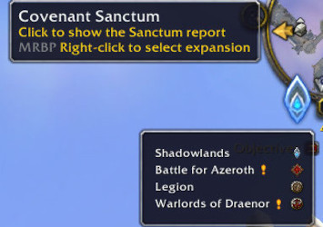
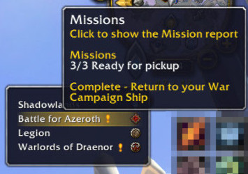
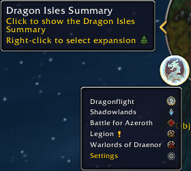
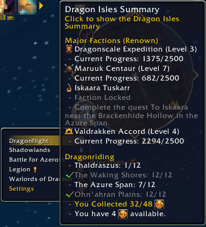

# Mission Report Button Plus

Adds a right-click menu to the mission report button on the minimap (aka. the `Garrison-/ExpansionLandingPageMinimapButton`) for selecting mission reports of previous expansions.  
*(See full feature list [below](#features))*  
  
<!-- 
   -->
  

  
(More images on this [project's screenshots page](https://www.curseforge.com/wow/addons/mission-report-button-plus/screenshots))  

## About this add-on

### Problem

As soon as a new WoW expansion has been released the button on the minimap which opens the mission report frame is disabled until you meet certain criteria in order to send your little helpers on missions. But only the reports from the current expansion can be viewed by the now *replaced* minimap button with *no other options* to view reports of previous expansions any more unless you visit your old mission tables, and often only to find out that your too early and your missions are still *not completed*.  
I was very pleased to see that the WoW Companion app for mobile phones addressed this problem, but the main game still doesn't.

### Solution

It is still possible to access mission reports from previous expansions but the Blizzard devs still haven't implemented a possibility for users to access them via the graphical interface. So here comes this add-on to work:

+ it makes the minimap button for mission reports visible, if it has been hidden,  
+ it adds a right-click menu to the minimap button,  
+ with a selection of previous expansions and access to their mission reports, which are...  
+ **anytime and anywhere accessible.**  
*(See full feature list below.)*  

----

## Features

### Minimap Landing Page Button

+ [x] adds a right-click menu to the minimap button
+ [x] displays the minimap button of the previous expansion as long as the current command table hasn't been unlocked
+ [x] optionally shows or hides the minimap button itself permanently
+ [x] clicking a menu entry opens the (read-only) Mission Report Frame of the corresponding expansion

### Dropdown Menu

+ [x] see details about in-progress mission of each command table
+ [x] see which bounties, threats and world map events of each expansion are currently active
+ [x] expansions you (yet) don't own will be hidden in the menu
+ [x] expansions without an unlocked command table will be displayed, but disabled
  + [x] now showing a hint on how to unlock it
+ [x] WoD: get notified about Garrison Invasions
+ [x] Legion: see details about Demon Invasions
+ [x] BfA: see details about Faction and N'Zoth Assaults
+ [x] Shadowlands: see details about Covenant Assaults in The Maw
+ [x] Dragonflight: see details about your Major Faction Renown Level progress and Dragon Isles events

### Chat

+ [x] get informed in-chat on finished missions, talents, WoD garrison invasions and buildings, etc.
+ [x] chat messages can be disabled in the settings

### Common

+ [x] choose from a variety of settings and adjust the addon to your liking
  + [x] or de-/select the menu entries with the expansions that are no longer of interest to you
+ [x] more to come...
  
*If you want to see some examples of these features, go visit this project's [screenshots page](https://www.curseforge.com/wow/addons/mission-report-button-plus/screenshots).*  

----

### Known Issues

+ As soon as you unlock a command table the minimap button doesn't update automatically. The add-on gathers this information only once at startup in order to save memory. You need to reload the UI manually, eg. by typing `/reload` in the chat frame. Logging-out and -in again also works.  
  I will tend to this as soon as possible.

----

## Interested in helping?

*Contributors are most welcome!*  
[Report a problem](https://github.com/erglo/mission-report-button-plus/issues) on this project's issues page as soon as you find any errors.  
[Start translating](https://www.curseforge.com/wow/addons/mission-report-button-plus/localization) when you're missing your language or simply want to help with localization.  
[Leave a comment](https://www.curseforge.com/wow/addons/mission-report-button-plus#comments) if you have a *feature request* or *tell me what you think* about this add-on.

----

### Tools used

+ Microsoft's [Visual Studio Code](https://code.visualstudio.com) with ...  
  + Sumneko's [Lua Language Server](https://github.com/LuaLS/lua-language-server) extension  
  + Ketho's [World of Warcraft API](https://github.com/Ketho/vscode-wow-api) extension  
  + Stanzilla's [World of Warcraft TOC Language Support](https://github.com/Stanzilla/vscode-wow-toc) extension  
  + David Anson's [Markdown linting and style checking](https://github.com/DavidAnson/vscode-markdownlint) extension  
+ Version control management with [Git](https://git-scm.com)

### References

+ Townlong Yak's FrameXML archive (<https://www.townlong-yak.com/framexml/live>)
+ WoWpedia's World of Warcraft API (<https://wowpedia.fandom.com/wiki/World_of_Warcraft_API>)
+ Wowhead.com (<https://www.wowhead.com>)
+ Matt Cone's "The Markdown Guide" (<https://www.markdownguide.org>)
  *(Buy his [book](https://www.markdownguide.org/book)!)*
+ The Git Book (<https://git-scm.com/book>)
+ Documentation for Visual Studio Code (<https://code.visualstudio.com/docs>)
